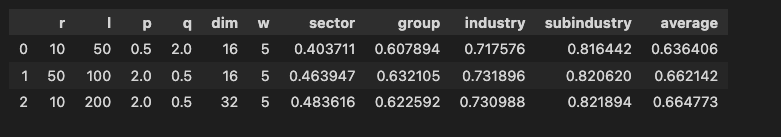
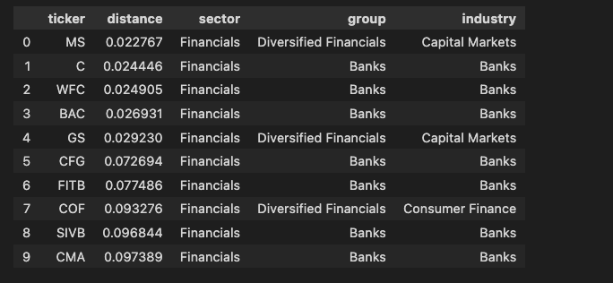

# Stock Embedding
This repo implements the methodology based on paper Learning Embedded Representation of the Stock Correlation Matrix using Graph Machine Learning.

The goal is to learn a vector representation of a ticker given the daily returns of a set of tickers. For example, AAPL is represented as a numpy array of size 32, just like word2vec.
```
'AAPL': array([-0.5099518 , -0.06737634,  0.48559666, -1.4538945 ,  1.6606339 ,
         0.3644821 , -0.01464582, -0.78605974,  0.47729206, -0.5726769 ,
         0.07515597, -1.2660204 , -0.42653227,  0.5527185 ,  0.07249957,
        -1.4414234 ,  0.6071886 , -0.22588927,  0.27790403,  0.898469  ,
        -1.2963198 ,  0.5084794 , -0.5935085 , -0.10640397, -0.94240546,
        -0.03292902,  0.741543  ,  0.8465433 , -0.81097144,  0.28370696,
        -0.12066484,  0.22394317], dtype=float32)
```
With the vectorized ticker, we can pass these elements in the vector to the downstream ML jobs.

## Example
This repo is able to replicate most of the results presented in the paper. Here is some examples from the notebook under src.

```python
# stock data are fetched via yfinance package, the log returns and correlations are cacluated internally
se = StockEmbedding(start_date='2021-01-01', end_date='2022-08-04')

# hyperparameter is tuned by maximizing average v-measure
param_lst = [{'l': 50, 'r': 10, 'p': 0.5, 'q': 2, 'w': 5, 'dim': 16},
             {'l': 100, 'r': 50, 'p': 2, 'q': 0.5, 'w': 5, 'dim': 16},
             {'l': 200, 'r': 10, 'p': 2, 'q': 0.5, 'w': 5, 'dim': 32}]

summary, opt_param = se.hyperparam_tuning(param_lst)
```
similar to Table 3 of the original paper


The stock embedding enables us to answer the following questions

* stock similarity
    ```python
    se.find_similar_stocks(ticker='JPM')
    ```
    All the top similar stocks are from Financial sector with most of them from Banks industry.
    

* Analogical Inference: answer question like "JPM is to GS as JNJ is to ?"
  ```python
  se.analogical_inference(ticker='AAPL', ticker_1='JPM', ticker_2='GS')
  ```
  The result is `JPM is to GS as AAPL is to AMZN` with a similarity of 0.9349383.

  ```python
  se.analogical_inference(ticker='JNJ', ticker_1='JPM', ticker_2='GS')
  ```
  The result is `JPM is to GS as JNJ is to GILD` with a similarity of 0.8816782.

*  Not Match Stock: Answer questions like: Does not match from JPM, MS, GS, GOOGL: GOOGL
   ```python
   se.identify_not_match_stock(['JPM', 'MS', 'GS', 'GOOGL'])
   ```
   The result is `Does not match from JPM, MS, GS, GOOGL: GOOGL`.

   ```python
   se.identify_not_match_stock(['JNJ', 'BMY', 'PFE', 'HD'])
   ```
   The result is `Does not match from JNJ, BMY, PFE, HD: HD`.

   ```python
   se.identify_not_match_stock(['UAL', 'AAL', 'DAL', 'TSLA'])
   ```
   The result is `Does not match from UAL, AAL, DAL, TSLA: TSLA`.